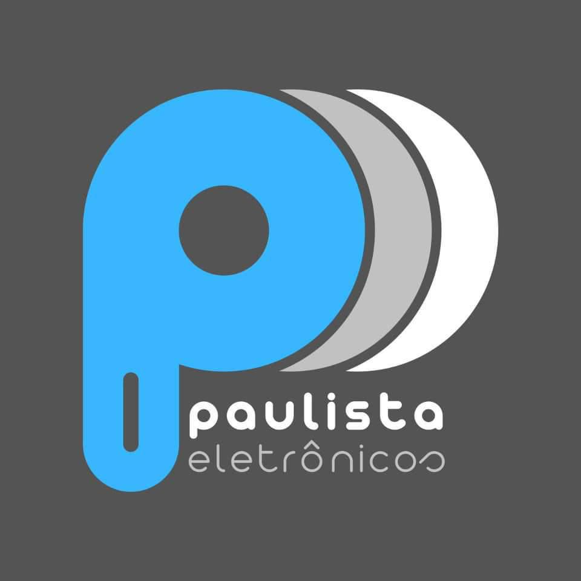
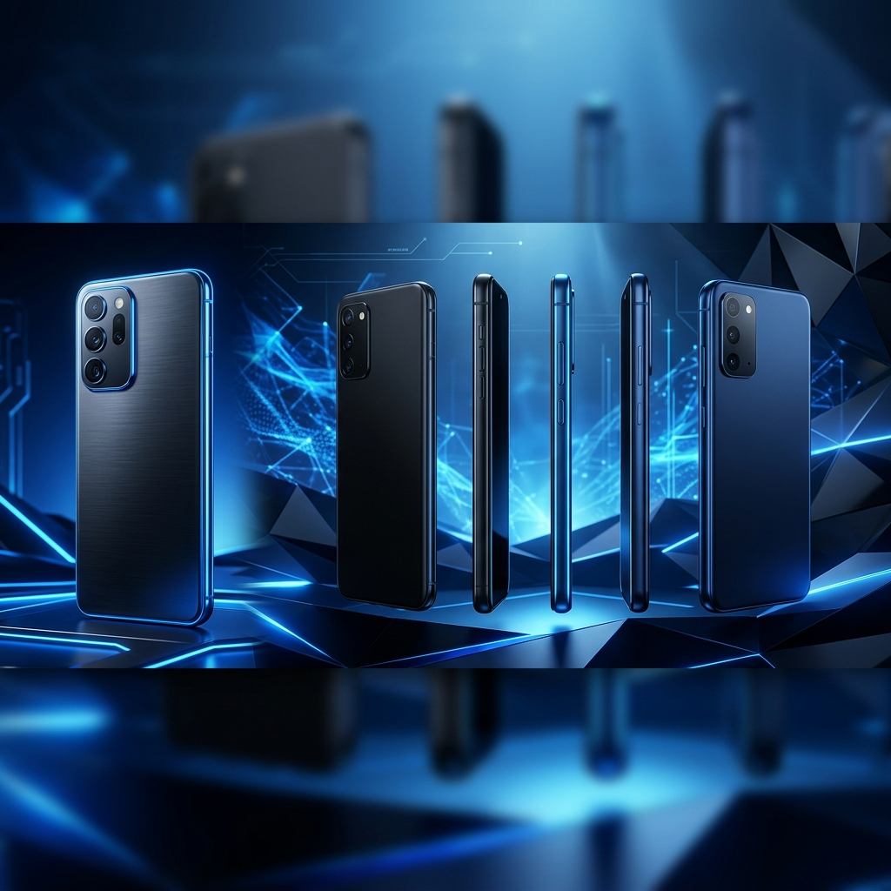
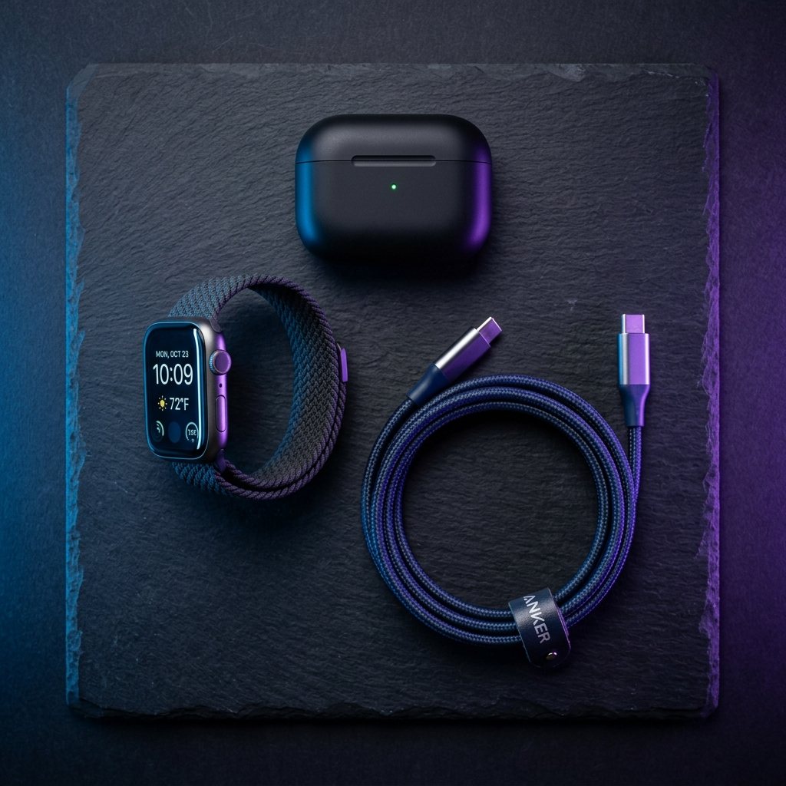
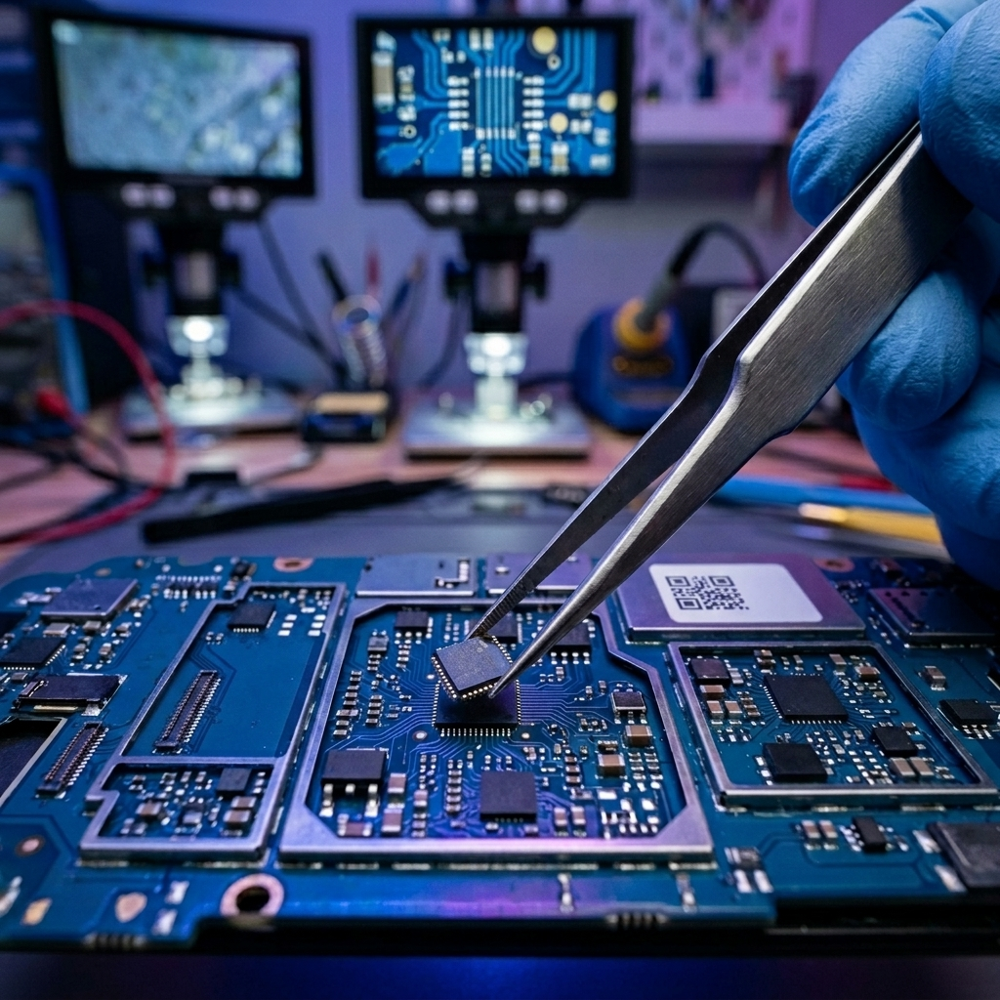

# Código Completo do Projeto - Paulista Eletrônicos

Este arquivo reúne todo o código-fonte legível do projeto para que você possa copiar e colar facilmente no chat com o Gemini (ou outra IA), sem incluir arquivos binários pesados (vídeos e imagens) que causam erros de importação.

## Estrutura do Projeto
```text
projpaulista eletro/
├── index.html
├── styles.css
├── script.js
└── assets/
    ├── video/
    │   └── Video Project 1.mp4 (Mídia - Não colar)
    └── images/
        ├── accessories.png (Mídia - Não colar)
        ├── hero.png (Mídia - Não colar)
        ├── logo.jpeg (Mídia - Não colar)
        ├── maintenance.png (Mídia - Não colar)
        └── WhatsApp Image 2026-04-28 at 18.30.15.jpeg (Mídia - Não colar)
```

---

## 1. Arquivo: `index.html`

```html
<!DOCTYPE html>
<html lang="pt-BR">

<head>
    <script>(function (w, d, s, l, i) {
            w[l] = w[l] || []; w[l].push({
                'gtm.start':
                    new Date().getTime(), event: 'gtm.js'
            }); var f = d.getElementsByTagName(s)[0],
                j = d.createElement(s), dl = l != 'dataLayer' ? '&l=' + l : ''; j.async = true; j.src =
                    'https://www.googletagmanager.com/gtm.js?id=' + i + dl; f.parentNode.insertBefore(j, f);
        })(window, document, 'script', 'dataLayer', 'GTM-TBSTZTWF');</script>
    <meta charset="UTF-8">
    <meta name="viewport" content="width=device-width, initial-scale=1.0">
    <title>Paulista Eletrônicos | Aparelhos, Acessórios e Manutenção</title>
    <meta name="description"
        content="A sua loja completa de aparelhos, acessórios premium e conserto de dispositivos.">
    <link rel="stylesheet" href="styles.css">
    <!-- FontAwesome for icons (optional, using CDN) -->
    <link rel="stylesheet" href="https://cdnjs.cloudflare.com/ajax/libs/font-awesome/6.4.0/css/all.min.css">
    <link rel="icon" href="assets/images/logo.jpeg" type="image/jpeg">
</head>

<body>
    <noscript><iframe src="https://www.googletagmanager.com/ns.html?id=GTM-TBSTZTWF" height="0" width="0"
            style="display:none;visibility:hidden"></iframe></noscript>

    <!-- Header -->
    <header>
        <div class="nav-container">
            <div class="logo">
                
                <span>Paulista <span style="color: var(--primary-dark);">Eletrônicos</span></span>
            </div>
            <ul class="nav-links">
                <li><a href="#inicio">Início</a></li>
                <li><a href="#servicos">Serviços</a></li>
                <li><a href="#contato">Contato</a></li>
            </ul>
            <a href="https://wa.me/5511989055948" target="_blank" class="btn btn-primary nav-btn">
                <i class="fa-brands fa-whatsapp"></i> Fale Conosco
            </a>
            <button class="mobile-toggle" aria-label="Abrir Menu">
                <i class="fa-solid fa-bars"></i>
            </button>
        </div>
    </header>

    <!-- Hero Section Parallax -->
    <section id="inicio" class="hero parallax-hero">
        <video id="hero-video" src="assets/video/Video Project 1.mp4" autoplay loop muted playsinline preload="auto"></video>
        <div class="video-overlay-gradient"></div>
        <div class="hero-content centered">
            <div class="hero-text text-center">
                <h1 style="color: white;">Tecnologia de ponta em <span class="text-gradient">suas mãos.</span></h1>
                <p style="color: #eee;">Na Paulista Eletrônicos, você encontra os melhores dispositivos, acessórios premium e arruma o seu com segurança e rapidez que sua rotina precisa. Faça um orçamento já!</p>
                <div class="hero-actions justify-center">
                    <a href="https://wa.me/5511989055948" target="_blank" class="btn btn-primary">
                        <i class="fa-brands fa-whatsapp"></i> Chamar no WhatsApp
                    </a>
                    <a href="#servicos" class="btn btn-outline" style="border-color: white; color: white;">Ver
                        Serviços</a>
                </div>
            </div>
        </div>
    </section>

    <!-- Serviços Bento Grid -->
    <section id="servicos" class="services">
        <h2 class="section-title reveal">O que <span class="text-gradient">oferecemos</span></h2>

        <div class="bento-grid">
            <!-- Vendas de Aparelhos (Card Grande) -->
            <div class="bento-card card-large reveal">
                
                <div class="bento-content">
                    <h3>Dispositivos de Diversas Marcas</h3>
                    <p>Encontre o seu próximo aparelho aqui. Trabalhamos com as melhores marcas do mercado, garantindo
                        procedência, qualidade e os últimos lançamentos para você.</p>
                </div>
            </div>

            <!-- Acessórios -->
            <div class="bento-card reveal">
                
                <div class="bento-content">
                    <h3>Acessórios Premium</h3>
                    <p>Capinhas, películas, carregadores, fones de ouvido e smartwatches. Tudo para proteger e
                        potencializar o seu aparelho.</p>
                </div>
            </div>

            <!-- Manutenção (Card Grande) -->
            <div class="bento-card card-large reveal">
                
                <div class="bento-content">
                    <h3>Aparelho Quebrou?</h3>
                    <p>Faça já um orçamento com nosso time. É rápido, fácil e sem custos! Trabalhamos com telas, baterias, conectores de altíssima qualidade, com o menor prazo da região.</p>
                </div>
            </div>

            <!-- Diferencial -->
            <div class="bento-card reveal" style="background: var(--primary-blue); color: white;">
                <div class="bento-content"
                    style="background: transparent; border: none; padding: 0; display: flex; flex-direction: column; justify-content: center; height: 100%;">
                    <i class="fa-solid fa-shield-halved" style="font-size: 3rem; margin-bottom: 20px;"></i>
                    <h3 style="color: white;">Garantia Total</h3>
                    <p style="color: rgba(255,255,255,0.8);">Todos os nossos serviços e produtos contam com garantia
                        para a sua total tranquilidade e segurança.</p>
                </div>
            </div>
        </div>
    </section>

    <!-- Contato e Localização -->
    <section id="contato" class="contact-section">
        <div class="contact-container">
            <div class="contact-info reveal">
                <h2>Faça uma <span style="color: var(--primary-blue);">visita</span></h2>
                <p>Venha nos visitar ou tire suas dúvidas diretamente pelo WhatsApp com nossa equipe de atendimento.</p>

                <div class="info-item">
                    <div class="info-icon">
                        <i class="fa-solid fa-location-dot"></i>
                    </div>
                    <div class="info-text">
                        <h4>Endereço</h4>
                        <p>Alameda Araguaia, 762 - Térreo, Loja 22<br>Alphaville, Barueri - SP, 06455-010</p>
                    </div>
                </div>

                <div class="info-item">
                    <div class="info-icon">
                        <i class="fa-solid fa-clock"></i>
                    </div>
                    <div class="info-text">
                        <h4>Horário de Funcionamento</h4>
                        <p>Segunda a Sexta: 10:00 às 19:00<br>Sábado: 10:00 às 15:00<br>Domingo: Fechado</p>
                    </div>
                </div>
            </div>

            <div class="contact-card reveal">
                <h3>Precisa de ajuda agora?</h3>
                <p style="color: #ccc;">Clique no botão abaixo e fale diretamente com um de nossos especialistas.
                    Orçamento sem compromisso!</p>
                <div style="display: flex; flex-direction: column; gap: 15px;">
                    <a href="https://wa.me/5511989055948" target="_blank" class="whatsapp-large">
                        <i class="fa-brands fa-whatsapp"></i> Iniciar Conversa
                    </a>
                    <a href="https://www.instagram.com/paulista_eletronicos_/" target="_blank" class="instagram-large">
                        <i class="fa-brands fa-instagram"></i> Siga nosso Instagram
                    </a>
                </div>
            </div>
        </div>

        <div class="map-container reveal">
            <iframe
                src="https://maps.google.com/maps?q=Alameda%20Araguaia%2C%20762%20-%20Alphaville%2C%20Barueri%20-%20SP&t=&z=15&ie=UTF8&iwloc=&output=embed"
                width="100%" height="400" style="border:0;" allowfullscreen="" loading="lazy"
                referrerpolicy="no-referrer-when-downgrade">
            </iframe>
        </div>
    </section>

    <!-- Footer -->
    <footer>
        <div class="footer-socials">
            <a href="https://www.instagram.com/paulista_eletronicos_/" target="_blank" aria-label="Instagram"><i
                    class="fa-brands fa-instagram"></i></a>
            <a href="https://wa.me/5511989055948" target="_blank" aria-label="WhatsApp"><i
                    class="fa-brands fa-whatsapp"></i></a>
        </div>
        <p>&copy; 2026 Paulista Eletrônicos. Todos os direitos reservados.</p>
    </footer>

    <script src="script.js"></script>
</body>

</html>
```

---

## 2. Arquivo: `styles.css`

```css
@import url('https://fonts.googleapis.com/css2?family=Outfit:wght@300;400;600;800&display=swap');

:root {
    --primary-blue: #29B6E8;         /* Azul exato da logo */
    --primary-blue-dark: #1A9AC8;    /* Versão levemente mais escura para hovers */
    --primary-dark: #3D3D3D;         /* Cinza escuro do fundo da logo */
    --bg-light: #F4F4F6;
    --bg-white: #FFFFFF;
    --glass-bg: rgba(255, 255, 255, 0.7);
    --glass-border: rgba(255, 255, 255, 0.5);
    --shadow-soft: 0 8px 32px rgba(41, 182, 232, 0.15);
    --transition-smooth: all 0.4s cubic-bezier(0.16, 1, 0.3, 1);
}

* {
    margin: 0;
    padding: 0;
    box-sizing: border-box;
    font-family: 'Outfit', sans-serif;
}

body {
    background-color: var(--bg-light);
    color: var(--primary-dark);
    line-height: 1.6;
    overflow-x: hidden;
}

/* =========================================
   Typography & Utils
   ========================================= */
h1,
h2,
h3,
h4 {
    font-weight: 800;
    line-height: 1.2;
}

a {
    text-decoration: none;
    color: inherit;
}

.text-gradient {
    background: linear-gradient(135deg, var(--primary-blue), #5bc0eb);
    -webkit-background-clip: text;
    -webkit-text-fill-color: transparent;
}

.btn {
    display: inline-flex;
    align-items: center;
    justify-content: center;
    padding: 16px 32px;
    border-radius: 50px;
    font-weight: 600;
    font-size: 1.1rem;
    cursor: pointer;
    transition: var(--transition-smooth);
    border: none;
    gap: 8px;
}

.btn-primary {
    background-color: var(--primary-blue);
    color: white;
    box-shadow: 0 4px 15px rgba(41, 182, 232, 0.4);
}

.btn-primary:hover {
    transform: translateY(-3px);
    box-shadow: 0 8px 25px rgba(41, 182, 232, 0.6);
    background-color: var(--primary-blue-dark);
}

.btn-outline {
    background-color: transparent;
    border: 2px solid var(--primary-dark);
    color: var(--primary-dark);
}

.btn-outline:hover {
    background-color: var(--primary-dark);
    color: white;
}

/* =========================================
   Navbar (Glassmorphism)
   ========================================= */
header {
    position: fixed;
    top: 0;
    left: 0;
    width: 100%;
    z-index: 1000;
    padding: 20px 0;
    transition: var(--transition-smooth);
}

/* Estado padrão: sobre o vídeo — transparente */
header {
    background: transparent;
}

/* Após sair do vídeo: azul sólido */
header.header-solid {
    padding: 12px 0;
    background: var(--primary-blue);
    box-shadow: 0 4px 24px rgba(0, 0, 0, 0.25);
    backdrop-filter: none;
    -webkit-backdrop-filter: none;
}

.nav-container {
    max-width: 1200px;
    margin: 0 auto;
    display: flex;
    justify-content: space-between;
    align-items: center;
    padding: 0 24px;
}

.logo {
    font-size: 1.5rem;
    font-weight: 800;
    display: flex;
    align-items: center;
    gap: 10px;
}

.logo-image {
    width: 45px;
    height: 45px;
    border-radius: 50%;
    /* Circle shape since it's an image */
    object-fit: cover;
    box-shadow: 0 4px 10px rgba(0, 0, 0, 0.1);
}

.nav-links {
    display: flex;
    gap: 32px;
    list-style: none;
}

.nav-links li a {
    font-weight: 600;
    position: relative;
    transition: var(--transition-smooth);
}

.nav-links li a::after {
    content: '';
    position: absolute;
    width: 0;
    height: 2px;
    bottom: -4px;
    left: 0;
    background-color: var(--primary-blue);
    transition: var(--transition-smooth);
}

.nav-links li a:hover::after {
    width: 100%;
}

.nav-btn {
    padding: 10px 24px;
    font-size: 1rem;
}

.mobile-toggle {
    display: none;
    background: none;
    border: none;
    color: white;
    font-size: 1.5rem;
    cursor: pointer;
    z-index: 1000;
}

/* =========================================
   Hero Section (Parallax Video)
   ========================================= */
.parallax-hero {
    position: relative;
    height: 100vh;
    width: 100%;
    overflow: hidden;
    display: flex;
    align-items: center;
    justify-content: center;
    background-color: #000;
}

#hero-video {
    position: absolute;
    top: 0;
    left: 0;
    width: 100%;
    height: 100%;
    object-fit: cover;
    z-index: 1;
    transition: opacity 1s ease-in-out;
    /* Garante que transform-origin esteja centrado para não cortar o vídeo */
    transform-origin: center center;
    will-change: transform, opacity;
}

.video-overlay-gradient {
    position: absolute;
    top: 0;
    left: 0;
    width: 100%;
    height: 100%;
    /* Gradiente usando as cores da logo: azul do topo, cinza escuro embaixo */
    background: linear-gradient(to bottom, rgba(41, 182, 232, 0.1) 0%, rgba(61, 61, 61, 0.85) 100%);
    z-index: 2;
}

.centered {
    position: relative;
    z-index: 3;
    display: flex;
    flex-direction: column;
    align-items: center;
    justify-content: center;
    width: 100%;
    padding: 0 24px;
}

.hero-text.text-center {
    text-align: center;
    max-width: 800px;
    margin: 0 auto;
}

.hero-text h1 {
    font-size: 4.5rem;
    margin-bottom: 24px;
    letter-spacing: -1px;
}

.hero-text p {
    font-size: 1.25rem;
    margin-bottom: 40px;
    max-width: 600px;
    margin-left: auto;
    margin-right: auto;
}

.hero-actions.justify-center {
    display: flex;
    justify-content: center;
    gap: 16px;
}

.hero-actions .btn-outline:hover {
    background-color: white;
    color: var(--primary-dark) !important;
}

/* =========================================
   Bento Grid Services
   ========================================= */
.services {
    padding: 100px 24px;
    max-width: 1200px;
    margin: 0 auto;
}

.section-title {
    text-align: center;
    font-size: 3rem;
    margin-bottom: 60px;
}

.bento-grid {
    display: grid;
    grid-template-columns: repeat(3, 1fr);
    grid-auto-rows: 350px;
    gap: 24px;
}

.bento-card {
    background: var(--bg-white);
    border-radius: 32px;
    padding: 40px;
    position: relative;
    overflow: hidden;
    box-shadow: 0 4px 20px rgba(0, 0, 0, 0.03);
    transition: var(--transition-smooth);
    display: flex;
    flex-direction: column;
    justify-content: flex-end;
    border: 1px solid rgba(0, 0, 0, 0.05);
}

.bento-card:hover {
    transform: translateY(-10px);
    box-shadow: var(--shadow-soft);
}

.bento-card img {
    position: absolute;
    top: 0;
    left: 0;
    width: 100%;
    height: 100%;
    object-fit: cover;
    transition: var(--transition-smooth);
}

.bento-card:hover img {
    transform: scale(1.05);
}

.bento-content {
    position: relative;
    z-index: 2;
    background: var(--glass-bg);
    backdrop-filter: blur(12px);
    padding: 24px;
    border-radius: 20px;
    border: 1px solid var(--glass-border);
}

.bento-content h3 {
    font-size: 1.5rem;
    margin-bottom: 8px;
}

.bento-content p {
    font-size: 1rem;
    color: #444;
}

.card-large {
    grid-column: span 2;
}

/* =========================================
   Location & Contact (Bento Style)
   ========================================= */
.contact-section {
    padding: 100px 24px;
    background-color: var(--primary-dark);
    color: white;
}

.contact-container {
    max-width: 1200px;
    margin: 0 auto;
    display: grid;
    grid-template-columns: 1fr 1fr;
    gap: 60px;
    align-items: center;
}

.contact-info h2 {
    font-size: 3rem;
    margin-bottom: 24px;
}

.contact-info p {
    font-size: 1.2rem;
    color: #ccc;
    margin-bottom: 40px;
}

.info-item {
    display: flex;
    align-items: flex-start;
    gap: 16px;
    margin-bottom: 24px;
}

.info-icon {
    width: 48px;
    height: 48px;
    background-color: rgba(255, 255, 255, 0.1);
    border-radius: 50%;
    display: flex;
    align-items: center;
    justify-content: center;
    font-size: 1.5rem;
    color: var(--primary-blue);
    flex-shrink: 0;
}

.info-text h4 {
    font-size: 1.2rem;
    margin-bottom: 4px;
}

.info-text p {
    font-size: 1rem;
    margin-bottom: 0;
}

.contact-card {
    background: rgba(255, 255, 255, 0.05);
    backdrop-filter: blur(20px);
    padding: 40px;
    border-radius: 32px;
    border: 1px solid rgba(255, 255, 255, 0.1);
    text-align: center;
}

.contact-card h3 {
    font-size: 2rem;
    margin-bottom: 20px;
}

.whatsapp-large {
    display: inline-flex;
    align-items: center;
    justify-content: center;
    gap: 12px;
    background-color: #25D366;
    color: white;
    padding: 20px 40px;
    border-radius: 50px;
    font-size: 1.5rem;
    font-weight: 800;
    transition: var(--transition-smooth);
    margin-top: 20px;
}

.whatsapp-large:hover {
    transform: translateY(-5px);
    box-shadow: 0 10px 30px rgba(37, 211, 102, 0.4);
}

.instagram-large {
    display: inline-flex;
    align-items: center;
    justify-content: center;
    gap: 12px;
    background: linear-gradient(45deg, #f09433 0%, #e6683c 25%, #dc2743 50%, #cc2366 75%, #bc1888 100%);
    color: white;
    padding: 20px 40px;
    border-radius: 50px;
    font-size: 1.5rem;
    font-weight: 800;
    transition: var(--transition-smooth);
}

.instagram-large:hover {
    transform: translateY(-5px);
    box-shadow: 0 10px 30px rgba(220, 39, 67, 0.4);
}

.map-container {
    max-width: 1200px;
    margin: 60px auto 0;
    border-radius: 32px;
    overflow: hidden;
    box-shadow: 0 10px 40px rgba(0, 0, 0, 0.2);
    border: 1px solid rgba(255, 255, 255, 0.1);
}

.map-container iframe {
    display: block;
}

/* =========================================
   Footer
   ========================================= */
footer {
    text-align: center;
    padding: 40px 24px;
    background-color: #1a101f;
    color: #888;
}

.footer-socials {
    display: flex;
    justify-content: center;
    gap: 20px;
    margin-bottom: 20px;
}

.footer-socials a {
    color: #fff;
    font-size: 1.8rem;
    background: rgba(255, 255, 255, 0.1);
    width: 50px;
    height: 50px;
    border-radius: 50%;
    display: flex;
    align-items: center;
    justify-content: center;
    transition: var(--transition-smooth);
}

.footer-socials a:hover {
    background: var(--primary-blue);
    transform: translateY(-5px);
}

/* =========================================
   Reveal Animations
   ========================================= */
.reveal {
    opacity: 0;
    transform: translateY(40px);
    transition: all 0.8s cubic-bezier(0.16, 1, 0.3, 1);
}

.reveal.active {
    opacity: 1;
    transform: translateY(0);
}

/* =========================================
   Responsive
   ========================================= */
@media (max-width: 992px) {
    .hero-content {
        grid-template-columns: 1fr;
        text-align: center;
        padding-top: 80px;
    }

    .hero-text p {
        margin: 0 auto 40px;
    }

    .hero-actions {
        justify-content: center;
    }

    .bento-grid {
        grid-template-columns: 1fr;
        grid-auto-rows: auto;
    }

    .card-large {
        grid-column: span 1;
    }

    .bento-card {
        min-height: 400px;
    }

    .contact-container {
        grid-template-columns: 1fr;
    }
}

@media (max-width: 768px) {
    .mobile-toggle {
        display: block;
    }

    .nav-links {
        position: fixed;
        top: 0;
        right: -100%;
        width: 100%;
        height: 100vh;
        background: rgba(41, 182, 232, 0.97);
        backdrop-filter: blur(20px);
        flex-direction: column;
        justify-content: center;
        align-items: center;
        transition: right 0.4s ease;
        z-index: 999;
    }

    .nav-links.active {
        right: 0;
    }

    .nav-links li a {
        font-size: 2rem;
    }

    .nav-btn {
        display: none;
    }

    .hero-text h1 {
        font-size: 2.5rem;
    }

    /* Mobile: desativa parallax e garante vídeo no fundo sem bugs */
    .parallax-hero {
        height: 100svh;
        /* svh respeita a barra do navegador no iOS */
    }

    #hero-video {
        /* No mobile, fixa o vídeo centralizado sem transform */
        top: 50%;
        left: 50%;
        min-width: 100%;
        min-height: 100%;
        width: auto;
        height: auto;
        transform: translate(-50%, -50%) !important;
    }
}
```

---

## 3. Arquivo: `script.js`

```javascript
document.addEventListener('DOMContentLoaded', () => {
    
    // ==========================================
    // 1. Mobile Menu Logic
    // ==========================================
    const mobileToggle = document.querySelector('.mobile-toggle');
    const navLinks = document.querySelector('.nav-links');
    const navItems = document.querySelectorAll('.nav-links a');

    if (mobileToggle && navLinks) {
        mobileToggle.addEventListener('click', () => {
            navLinks.classList.toggle('active');
            
            // Toggle icon between bars and x
            const icon = mobileToggle.querySelector('i');
            if (navLinks.classList.contains('active')) {
                icon.classList.remove('fa-bars');
                icon.classList.add('fa-xmark');
            } else {
                icon.classList.remove('fa-xmark');
                icon.classList.add('fa-bars');
            }
        });

        // Close menu when clicking a link
        navItems.forEach(item => {
            item.addEventListener('click', () => {
                navLinks.classList.remove('active');
                const icon = mobileToggle.querySelector('i');
                icon.classList.remove('fa-xmark');
                icon.classList.add('fa-bars');
            });
        });
    }

    // ==========================================
    // 2. Smooth Scrolling for Anchor Links
    // ==========================================
    document.querySelectorAll('a[href^="#"]').forEach(anchor => {
        anchor.addEventListener('click', function (e) {
            e.preventDefault();
            const targetId = this.getAttribute('href');
            if (targetId === '#') return;
            
            const targetElement = document.querySelector(targetId);
            if (targetElement) {
                targetElement.scrollIntoView({
                    behavior: 'smooth',
                    block: 'start'
                });
            }
        });
    });

    // ==========================================
    // 3. Scroll Reveal Animations (Intersection Observer)
    // ==========================================
    const revealElements = document.querySelectorAll('.reveal');
    
    const revealOptions = {
        threshold: 0.15, // Triggers when 15% of the element is visible
        rootMargin: "0px 0px -50px 0px"
    };

    const revealOnScroll = new IntersectionObserver(function(entries, observer) {
        entries.forEach(entry => {
            if (!entry.isIntersecting) {
                return;
            } else {
                entry.target.classList.add('active');
                observer.unobserve(entry.target); // Stop observing once revealed
            }
        });
    }, revealOptions);

    revealElements.forEach(el => {
        revealOnScroll.observe(el);
    });

    // ==========================================
    // 4. Video Parallax & Smooth Loop Logic
    // ==========================================
    const video = document.getElementById('hero-video');
    if (video) {
        // Parallax apenas em desktop — mobile não suporta bem o transform em vídeos
        const isDesktop = window.matchMedia('(min-width: 769px)');

        if (isDesktop.matches) {
            window.addEventListener('scroll', () => {
                const scrollPosition = window.scrollY;
                video.style.transform = `translateY(${scrollPosition * 0.4}px)`;
            }, { passive: true });
        }

        // Smooth fade out before looping to avoid hard cuts
        video.addEventListener('timeupdate', () => {
            const timeRemaining = video.duration - video.currentTime;
            if (timeRemaining <= 1.0 && timeRemaining > 0) {
                video.style.opacity = '0';
            } else if (video.currentTime <= 1.0) {
                video.style.opacity = '1';
            }
        });
    }

    // ==========================================
    // 5. Header Dinâmico (Transparente sobre vídeo / Azul sólido após)
    // ==========================================
    const header = document.querySelector('header');
    const heroSection = document.querySelector('.parallax-hero');

    const updateHeader = () => {
        if (!heroSection) return;
        const heroBottom = heroSection.getBoundingClientRect().bottom;

        if (heroBottom > 0) {
            // Ainda dentro da área do vídeo: transparente
            header.classList.remove('header-solid');
        } else {
            // Passou o vídeo: azul sólido
            header.classList.add('header-solid');
        }
    };

    window.addEventListener('scroll', updateHeader, { passive: true });
    updateHeader(); // Roda ao carregar também

});
```
